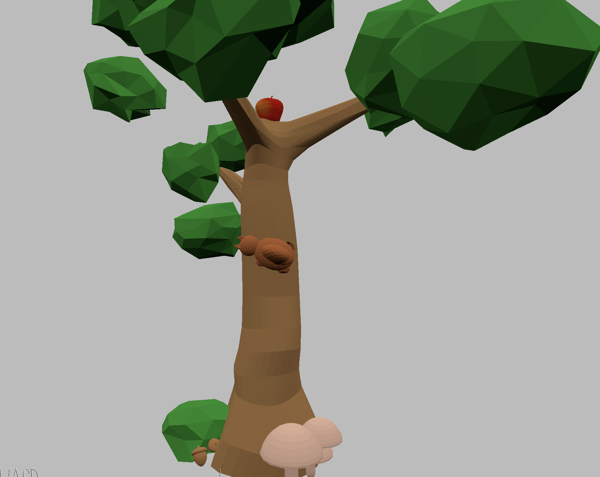

# Forest Feast

Author: Flora Cheng

Design: 
<!-- (TODO: In two sentences or fewer, describe what is new and interesting about your game.) -->
Using a walkmesh, we are now navigating not only on a flat plane but a mesh of a tree! Run around as a squirrel all over a tree, collecting all the goodies for a feast!

Screen Shot:

How To Play:

<!-- (TODO: describe the controls and (if needed) goals/strategy.) -->
Use wasd to move the squirrel (the squirrel will move by it's own orientation). Press e to interact/collect the items.
You're goal is to collect all 4 items: an apple, worm, acorn, and mushroom, to create a glorious feast!

<!-- Sources: (TODO: list a source URL for any assets you did not create yourself. Make sure you have a license for the asset.) -->
A large part of the Walkmesh was made from an in-class coding session.

This game was built with [NEST](NEST.md).

